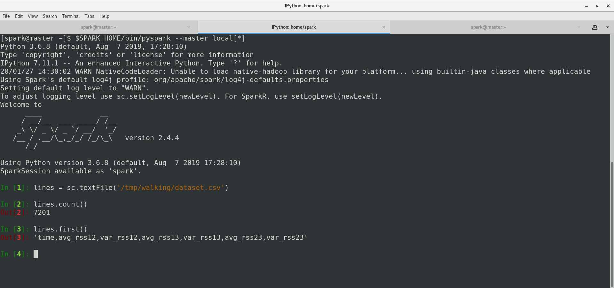

# Spark Notes


### Environment variables
___
```bash
export JAVA_HOME=/usr/java/default
export PATH=$PATH:$JAVA_HOME/bin
export SPARK_HOME=/opt/spark
export PATH=$PATH:$SPARK_HOME/bin
export PYSPARK_PYTHON=/usr/bin/python3
export PYSPARK_DRIVER_PYTHON=ipython
export HADOOP_HOME=/opt/hadoop
```

### Start & Stop Spark Instance Procedures
___

+ **Start master instance**
```bash
    $SPARK_HOME/sbin/start-master.sh
```

+ **Stop master instance**
```bash
    $SPARK_HOME/sbin/stop-master.sh
```

### Web Console
___
+ **URL** : http://master.hadoop.student.gsu.edu:8080/


### PySpark 
___
+ **Local:** 
```bash
    $SPARK_HOME/bin/pyspark --master local[*]
```

+ **Cluster:** 
```bash
    $SPARK_HOME/bin/pyspark --master spark://master.hadoop.student.gsu.edu:7077
```

### PySpark Smoke Test
___
+ **Dataset** : https://archive.ics.uci.edu/ml/machine-learning-databases/00366/AReM.zip

```python
    lines = sc.textFile('/tmp/walking/dataset.csv')
    lines.count()
```

+ **Screenshot**
