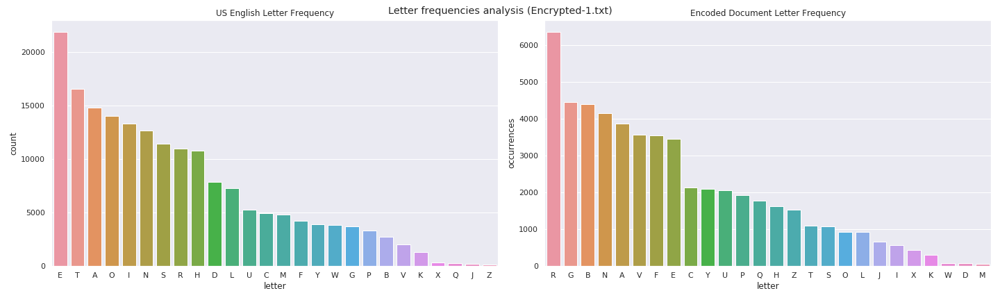
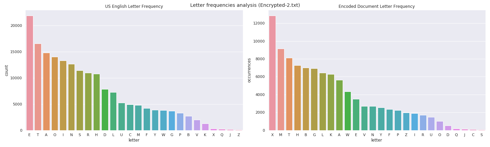
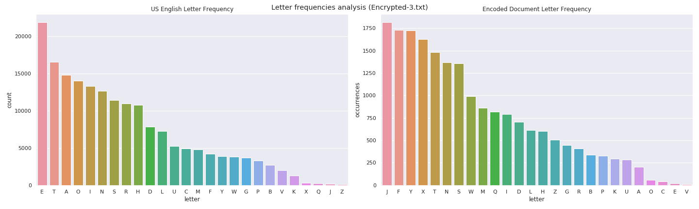

## **Midterm**
### **Caesar Cypher Application**
____


### **Instructions**
____
For this midterm you will be performing an analysis on a document that has been converted using a Caesar Cypher.

To do this you will do the following:
+ Word Count of the document
+ Character Count of the document
+ Comparison to the expected frequencies of characters in the English Language
+ Use a natural language processing library to compare samples of the words within your document to see if they are valid english words
+ Find the correct decryption of the document and save the output file.

Please write a report illustrating your experiments. You need to explain your basic idea about how to design the computing algorithm. You may add comments to the source code such that the source code can be read and understood by the graders.

In the report, you should include the answers to the following questions.

1. Explanation of the source code:
    + What are the functions of your lambda functions?
    + Which kind of intermediate results are generated?

2. Experimental Results
    + Screenshots of the key steps. For example, the screenshot for the outputs in the terminal when you run the command.
    + It will demonstrate that your program has no bug.

3. Explain your results. Does your implementation give the exact Caesar Cypher values?

Submission Materials:

    a. Your report

    b. Source code (link to .py/.scala file in GitHub or BitBucket)

    c. The outputs in the terminal (Intermediate results)

    d. The output file of your program (Decrypted document values using the .saveAsTextFile command )

    e. The name of the source each file came from


### **Implementation**
____

#### **Explanation of the source code**
____
+ **Program :** [cypher.py](cypher.py)

+ **How to use it :**

    + Using python command line interpreter
    ```
    python cypher.py -h

    usage: cypher.py [-h] --encode-file <file> [--without-decrypt <boolean>]
                    [--decrypt-key <integer>] [--decode-file <path>]
                    [--decode-rdd <path>] [--freq-en-letters <path>]
                    [--freq-sample-size <float>] [--total-attempts <float>]

    Spark Caesar Cypher Application

    optional arguments:
    -h, --help            show this help message and exit

    Required arguments:
    --encode-file <file>  File location of the encoded document

    Optional arguments:
    --without-decrypt <boolean>
                            Dont decrypt encoded document
    --decrypt-key <integer>
                            Decode the document based on <decrypt-key> number
    --decode-file <path>  Path to save the decoded text document
    --decode-rdd <path>   Directory to save the decoded RDD partition
    --freq-en-letters <path>
                            Path of frequency English letters file
    --freq-sample-size <float>
                            Sample size used by auto decrypt
    --total-attempts <float>
                            Minimum numbers of attempts used by auto decrypt to
                            define is a word is a English word
    ```

    + Using spark-submit command line utility
    ```bash
    $SPARK_HOME/bin/spark-submit cypher.py [options] 
    ```

+ **Lambda functions :**

    + ***split_word :*** split a line into words using regular expression. 

    ```python
    def split_word(content):
        REG_EXPR = "'?([_-a-zA-z0-9']+)'?"

        pattern = re.compile(r'{}'.format(REG_EXPR))
        matches = pattern.finditer(content)
        words   = []

        for match in matches:
            words.append(match.group(0))

        return words
    ```

    + ***decrypt :*** decrypt Ceaser Cypher string using a passed key.

    ```python 
    def decrypt(key, message):
        cypher_alpha = "ABCDEFGHIJKLMNOPQRSTUVWXYZ"

        message = message.upper()
        result = ""

        for letter in message:
            new_key = (cypher_alpha.find(letter) - key) % len(cypher_alpha)
            result = result + get_shifted_letter(new_key, letter)

        return result
    ```

+ **Intermediate results :**
+ The program creates a frequency letter report of the encoded document and compare it with a English letter frequency dataset [letter_frequency_en_US.csv](resources/letter_frequency_en_US.csv) in order to generate the sequence of decode keys. 

+ Natural Language Toolkit package (NLTK) is used to figure out if a sample word is an English word or not.

#### **Experimental Results**
Cracking Caesar Cipher
____

#### 1. Dependencies packages ####
____
``` python
import re
import pandas as pd
import seaborn as sns
import matplotlib.pyplot as plt
import nltk

from nltk.corpus import words
from matplotlib import rcParams

%matplotlib inline
```

#### 2. Default ploting style ####
____
``` python
sns.set(style="whitegrid")
sns.set(rc={'figure.figsize':(20,6)})
```

#### 3. Support Functions ####
____
``` python
def get_shifted_letter(new_key, letter):
    
    cypher_alpha = "ABCDEFGHIJKLMNOPQRSTUVWXYZ"

    return (cypher_alpha[new_key] if letter in cypher_alpha else letter)    

def encrypt(key, message):
    cypher_alpha = "ABCDEFGHIJKLMNOPQRSTUVWXYZ"

    message = message.upper()
    result = ""

    for letter in message:
        new_key = (cypher_alpha.find(letter) + key) % len(cypher_alpha)
        result = result + get_shifted_letter(new_key, letter)

    return result

def decrypt(key, message):
    cypher_alpha = "ABCDEFGHIJKLMNOPQRSTUVWXYZ"

    message = message.upper()
    result = ""

    for letter in message:
        new_key = (cypher_alpha.find(letter) - key) % len(cypher_alpha)
        result = result + get_shifted_letter(new_key, letter)

    return result

```

#### 4. Natural Language Toolkit Dictionary ####
____
``` python
nltk.download('words')
```


#### 5. Loading letter frequency report file (Encrypted-1.txt) ####
____
```python
dataset = "../resources/Encrypted-1_frequency_letters.csv"

letters = pd.read_csv(dataset)
```

#### 6. Filtering and Sorting the dataset ####
____
```python
cond = letters['letter'].str.contains('[A-Z]')
ceaser_letters = letters[cond].copy(deep=True)

ceaser_letters.sort_values(by=['occurrences'],ascending=False, inplace=True)
```

#### 7. Loading English letter frequency datasource
____
```python 
dataset = "../resources/letter_frequency_en_US.csv"

en_letters = pd.read_csv(dataset)
```

#### 8. Plotting letter analysis 
____
```python
fig, ax = plt.subplots(1, 2)

fig.suptitle('Letter frequencies analysis (Encrypted-1.txt)')

ax[0].set_title('US English Letter Frequency')
ax[1].set_title('Encoded Document Letter Frequency')

sns.barplot(x='letter', y='count', data=en_letters, ax=ax[0])
sns.barplot(x='letter', y='occurrences', data=ceaser_letters, ax=ax[1])

fig.tight_layout()

fig.savefig('../output/images/frequencies_analysis_Encrypted-1.png')
```



```python
print (f"Shift of the most frequency letter : {ord(ceaser_letters['letter'].head(1).values[0]) - ord(en_letters['letter'].head(1).values[0])}")

Shift of the most frequency letter : 13
```

#### 9. Decoding a sample string using key size provided by the plot 
________
```python 
sample = "CNEGVPHYNE CREVBQ BS SYNXVARFF BA VOZ"

print(decrypt(13, sample))

PARTICULAR PERIOD OF FLAKINESS ON IBM
```

#### 10. Loading letter frequency report file (Encrypted-2.txt)
____
```python
dataset = "../resources/Encrypted-2_frequency_letters.csv"

letters = pd.read_csv(dataset)
```

#### 11. Filtering and Sorting the dataset
____
```python
cond = letters['letter'].str.contains('[A-Z]')
ceaser_letters = letters[cond].copy(deep=True)

ceaser_letters.sort_values(by=['occurrences'],ascending=False, inplace=True)
```

#### 12. Plotting letter analysis
____
```python
fig, bx = plt.subplots(1, 2)

fig.suptitle('Letter frequencies analysis (Encrypted-2.txt)')

bx[0].set_title('US English Letter Frequency')
bx[1].set_title('Encoded Document Letter Frequency')

sns.barplot(x='letter', y='count', data=en_letters, ax=bx[0])
sns.barplot(x='letter', y='occurrences', data=ceaser_letters, ax=bx[1])

fig.tight_layout()

fig.savefig('../output/images/frequencies_analysis_Encrypted-2.png')
```


```python
print (f"Shift of the most frequency letter : {ord(ceaser_letters['letter'].head(1).values[0]) - ord(en_letters['letter'].head(1).values[0])}")

Shift of the most frequency letter : 19
```

#### 13. Decoding a sample string using key size provided by the plot
_____
```python
sample = "TFHGZLM MAHLX B ATW HVVTLBHG MH VTEE HG TM LM."

print(decrypt(19, sample))

AMONGST THOSE I HAD OCCASION TO CALL ON AT ST.
```

#### 14. Loading letter frequency report file (Encrypted-3.txt)
___
```python
dataset = "../resources/Encrypted-3_frequency_letters.csv"

letters = pd.read_csv(dataset)
```

#### 15. Filtering and Sorting the dataset
___
```python
cond = letters['letter'].str.contains('[A-Z]')
ceaser_letters = letters[cond].copy(deep=True)

ceaser_letters.sort_values(by=['occurrences'],ascending=False, inplace=True)
```

#### 16. Plotting letter analysis
____
```python 
fig, cx = plt.subplots(1, 2)

fig.suptitle('Letter frequencies analysis (Encrypted-3.txt)')

cx[0].set_title('US English Letter Frequency')
cx[1].set_title('Encoded Document Letter Frequency')

sns.barplot(x='letter', y='count', data=en_letters, ax=cx[0])
sns.barplot(x='letter', y='occurrences', data=ceaser_letters, ax=cx[1])

fig.tight_layout()

fig.savefig('../output/images/frequencies_analysis_Encrypted-3.png')
```


```python
print (f"Shift of the most frequency letter : {ord(ceaser_letters['letter'].head(1).values[0]) - ord(en_letters['letter'].head(1).values[0])}")

Shift of the most frequency letter : 5
```

#### 17. Decoding a sample string using key size provided by the plot
____
```python
sample = "FX SNHP'X YFCN LWTFSX FBFD, LFYXGD FUUJFWX XYWNINSL YMWTZLM"

print(decrypt(5, sample))

AS NICK'S TAXI GROANS AWAY, GATSBY APPEARS STRIDING THROUGH
```

### **Explain your results**
____
+ Running [cypher.py](cypher.py)

    + The default size for sampling RDD words is defined as **0.05** and the default number of successful translations to English is defined as **5** attempts. These numbers can be adjusted via ***--freq-sample-size*** and ***--total-attempts*** optional parameters.

    + First File ([Encrypted-1.txt](resources/Encrypted-1.txt))
        + Result
        ```
        python cypher.py --encode-file resources/Encrypted-1.txt

        Spark Caesar Cypher Application
        Big Data Programming - Spring 2020
        Georgia State University

        Parameters:
            File location of the encoded document........: resources/Encrypted-1.txt
            Path to save the decrypted document..........: resources/Encrypted-1_decoded.txt
            Path location of RDD decoded partition.......: output/rdd/Encrypted-1/
            Without decode document generation...........: False
            Decryption key...............................: auto    

        20/03/01 11:41:37 WARN NativeCodeLoader: Unable to load native-hadoop library for your platform... using builtin-java classes where applicable
        Using Spark's default log4j profile: org/apache/spark/log4j-defaults.properties
        Setting default log level to "WARN".
        To adjust logging level use sc.setLogLevel(newLevel). For SparkR, use setLogLevel(newLevel).
        Process completed in 16.99119 second(s)                                   
        ```
        + Output file [Encrypted-1_decoded.txt](resources/Encrypted-1_decoded.txt)


    + Second File ([Encrypted-2.txt](resources/Encrypted-2.txt))
        + Result
        ```
        python cypher.py --encode-file resources/Encrypted-2.txt
        Spark Caesar Cypher Application
            Big Data Programming - Spring 2020
            Georgia State University

        Parameters:
            File location of the encoded document........: resources/Encrypted-2.txt
            Path to save the decrypted document..........: resources/Encrypted-2_decoded.txt
            Path location of RDD decoded partition.......: output/rdd/Encrypted-2/
            Without decode document generation...........: False
            Decryption key...............................: auto    

        20/03/01 11:52:21 WARN NativeCodeLoader: Unable to load native-hadoop library for your platform... using builtin-java classes where applicable
        Using Spark's default log4j profile: org/apache/spark/log4j-defaults.properties
        Setting default log level to "WARN".
        To adjust logging level use sc.setLogLevel(newLevel). For SparkR, use setLogLevel(newLevel).
        Process completed in 15.617613 second(s)                              
        ```
        + Output file [Encrypted-2_decoded.txt](resources/Encrypted-2_decoded.txt)


    + Third File ([Encrypted-3.txt](resources/Encrypted-3.txt))
        + Result
        ```
        python cypher.py --encode-file resources/Encrypted-3.txt

        Spark Caesar Cypher Application
            Big Data Programming - Spring 2020
            Georgia State University

        Parameters:
            File location of the encoded document........: resources/Encrypted-3.txt
            Path to save the decrypted document..........: resources/Encrypted-3_decoded.txt
            Path location of RDD decoded partition.......: output/rdd/Encrypted-3/
            Without decode document generation...........: False
            Decryption key...............................: auto    

        20/03/01 11:54:07 WARN NativeCodeLoader: Unable to load native-hadoop library for your platform... using builtin-java classes where applicable
        Using Spark's default log4j profile: org/apache/spark/log4j-defaults.properties
        Setting default log level to "WARN".
        To adjust logging level use sc.setLogLevel(newLevel). For SparkR, use setLogLevel(newLevel).
        Process completed in 14.095676 second(s)                              
        ```
        + Output file [Encrypted-3_decoded.txt](resources/Encrypted-3_decoded.txt)

